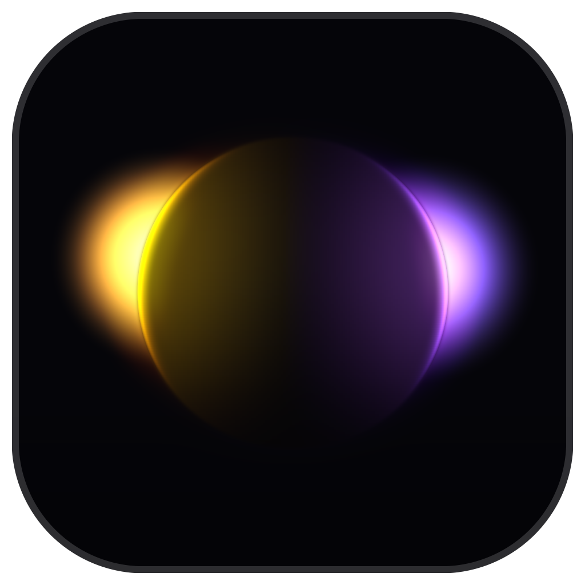

# RimStudio

Composite a cut-out into a plate, and make it look like it was photographed there.

A Photoshop companion: it pulls your cut-out layer and your background out of the
open document, matches them, and sends the result back as layers. The pixel work
happens in numpy, not in Photoshop, because the one thing that matters here —
gathering the colour a background actually emits onto a subject's edge — cannot be
done with layer maths.



## What it does

**Light from the background.** The rim, core and spill are sampled from the real
plate, unpremultiplied so the colour is the emitter's own rather than an average
diluted by everything dark around it. A subject standing between a warm lamp and a
blue window gets warm on one side and blue on the other, with no direction to set.

**Grade matching.** Exposure, contrast, colour cast, black point and saturation are
measured against the plate in **Lab**, so they stay independent — in RGB, moving
contrast drags hue with it. Exposure aims the subject a little above the plate's lit
level rather than at its mean; a night plate's mean would erase the subject.

**Glow, both ways.** Halation measured on the finished frame, plus the half that is
usually missing: light thrown *from* the subject back onto the plate. Without it, a
bright subject on a dark plate keeps a razor edge with no shared light across it,
which is most of what reads as "pasted on".

**Focus, grain, defringe, contact shadow.** Each measured rather than guessed — the
focus match solves for the blur radius at which the subject's detail level equals the
plate's, instead of multiplying by a constant.

**Three separate Auto buttons.** Auto match sets the grade. Auto focus and Auto glow
are deliberately separate: both are look decisions, and neither should jump every time
you re-run the main auto over a grade you have settled.

## Install

1. Put this folder anywhere. `Documents\Photoshop Scripts` is the usual home.
2. Python 3.10+ with `numpy` and `Pillow`.
3. For a permanent menu entry, copy `RimStudio.jsx` into
   `C:\Program Files\Adobe\Adobe Photoshop <version>\Presets\Scripts\`
   (needs an elevated copy, then restart Photoshop). It is a stub that runs
   `RimStudio Panel.jsx` from your Documents folder, so editing the tool never
   needs another elevated copy.

Otherwise: `File > Scripts > Browse...` and pick `RimStudio Panel.jsx`.

## Use

Select your cut-out layer in Photoshop and press **Pull from Photoshop**. The active
layer becomes the subject and everything else visible becomes the plate. No cut-out
yet? **Cut out subject** runs Photoshop's Select Subject and hides the original rather
than deleting it.

Then **Auto match**, adjust, and **Send to Photoshop**. It comes back as up to three
layers — the relit subject, a ground shadow underneath it, and the glow on top as a
Screen layer. Your background is never modified.

`Hold to compare` and the split view sit under the preview. Ctrl+wheel zooms,
Ctrl+Z undoes.

## Standalone

Runs without Photoshop too:

```
python rimstudio_gui.py subject.png background.png     # native window
python rimstudio_app.py subject.png background.png     # localhost web UI
```

The subject needs real transparency. The server binds to localhost only; `--lan`
opts in to the local network.

## Files

| | |
|---|---|
| `rim_engine.py` | the light gather, glow, grain, focus and shadow |
| `rim_grade.py` | plate matching in Lab |
| `rimstudio_app.py` | shared core, Photoshop bridge, web UI |
| `rimstudio_gui.py` | the native window |
| `rimstudio_ui.py` | Canvas-drawn widgets |
| `make_icon.py` | renders the icon by running the engine on a synthetic scene |
